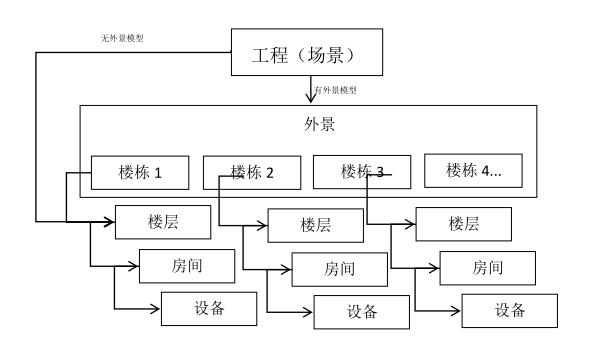
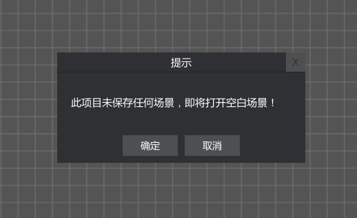
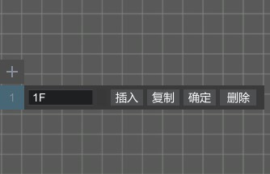
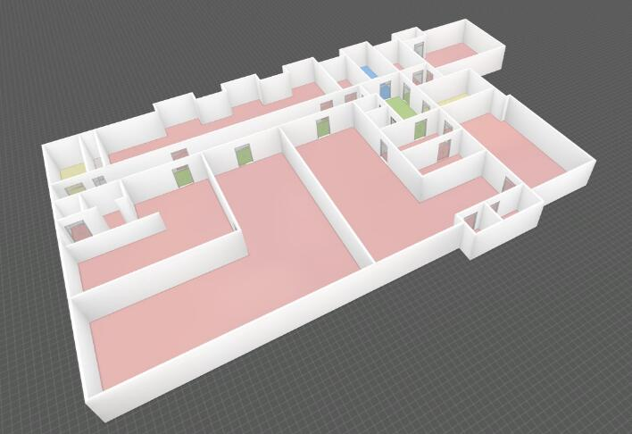
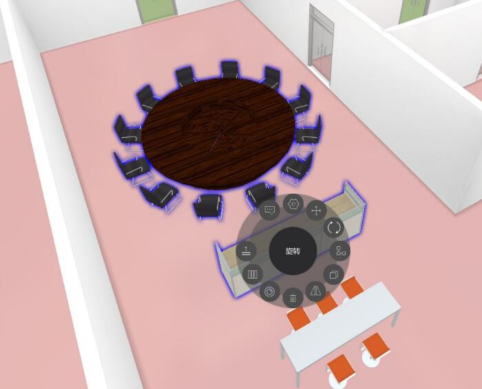
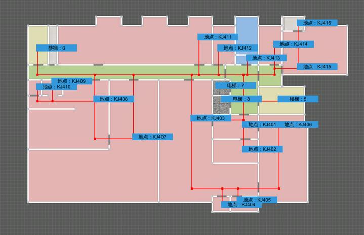
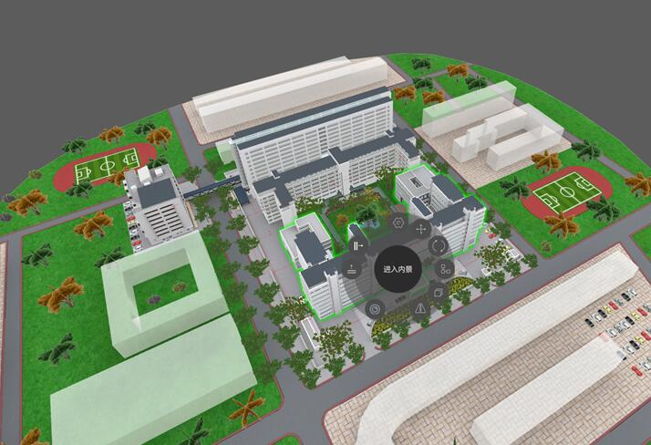
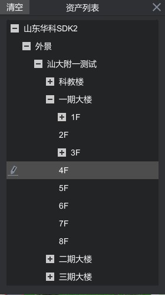
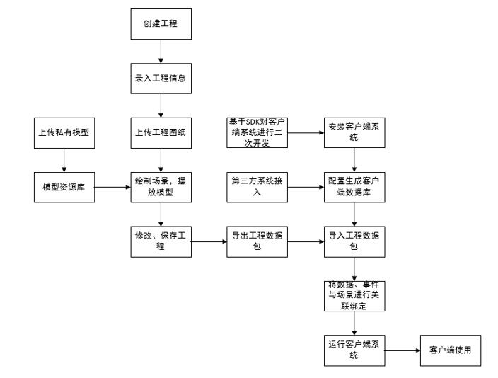

# SVE介绍

## 复杂三维场景构建
在[创建3D图形对象]()一章中我们已经介绍了如何用代码创建一个简单的3D图形对象。但是一般系统应用中3D可视化部分会使用到包含大量3D图形对象的复杂场景，这些对象又具有不同深度的层级结构，并且是实时动态变化的。比如门禁开关，制造机器人的机械臂运动状态这些又与现场情况实时连接，在这种情形下，我们用代码来一个个定义3D图形对象是不现实的。  
首先是复杂的几何结构，我们不会继续使用代码来一个个定义顶点坐标，而是使用现在市面上成熟的建模工具来建模，比如3DS MAX和MAYA，在建模完成后，通过我们的[导入工具]()转换成MiaokitJS框架所使用的资源格式，并保存到资源库中。一般我们仅用建模工具设计门、窗、家具家电、设备、景观等独立的对象。  
在设计出一个个独立的模型后，我们需要将它们搭建成一个复杂场景，确认它们所在层级、坐标位置、和唯一ID，然后我们在程序中才能与这些独立对象做数据关联和交互绑定，并且能单独地控制这些对象的各种状态。因此，SVE就是我们这里所必须的场景搭建工具。

## 基础概念
SVE即是一个三维场景搭建工具，也是一个三维地图瓦片制作工具。我们可以创建多个SVE工程，每个工程表示一个地图瓦片，搭建完成进行导出，然后在MiaokitJS框架中装载，就可以在前端呈现出我们所搭建的三维场景。  
一个SVE工程（三维地图瓦片）可以包含多个三维场景，通常是一个室外场景和多个室内场景。室内场景分多个楼层，多个房间。然后我们可以在这里场景中摆放数量不定的3D图形对象，以此美化和完善我们的可视化场景。  

## SVE操作简介
* 新建工程：进入SVE新建工程后，编辑器会提示默认新建一个空白场景，此时点击确认；  
  
* 新建图层：每个新建场景，编辑器会自动创建一个默认图层，在图层之上进行编辑，您也可以添加和插入新图层；  
  
* 编辑模式：楼层绘制、模型摆放、路径规划；  
楼层绘制：编辑一个楼层的建筑格局，包括墙面、地板、天花板绘制生成，门窗摆放、地砖墙纸设置；  
  
模型摆放：将设计师制作好的三维模型摆放到场景中，增加场景的细节或者是放置需要监控的重要资产；  
  
模型摆放可以层层打组，从而构建场景树形层级结构；  
  
路径规划：编辑规划寻路路径，编辑POI位置点，用于位置查找和导航；  
  
* 楼层管理：可以新建、插入、复制、命名楼层；  
  
* 场景管理：目前，编辑器除了默认场景，其它追加的场景都与一栋楼宇进行绑定关联（类似于传送门）。楼宇内场景亦可以插入新的楼宇（场景）。因此，场景会以树形结构组织，默认场景是根节点；  
  
* 视角管理：在树形结构的每个节点都可以设置单独的摄像机观察视角；  
  
* 工程对象树形图管理：编辑器编辑的项目数据会以树形结构组织，便于操作；  
  
* 项目实施流程：  
  
详细介绍和使用教程请访问[SVE官网](http://sve.yongtoc.com/)
